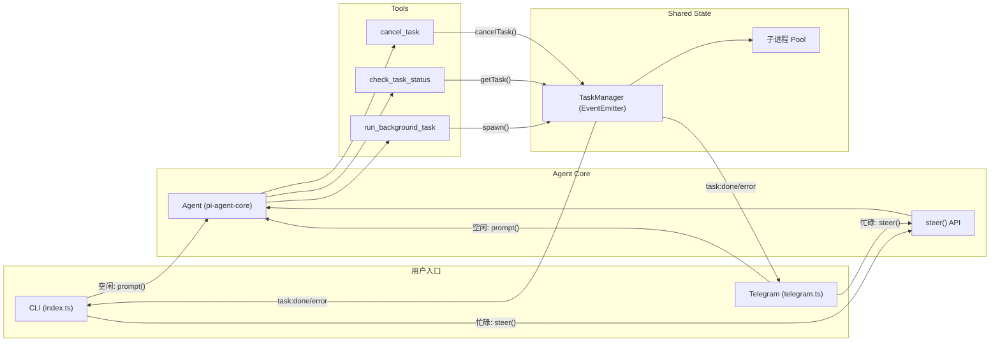

# Async Agent Architecture

实现了「一边执行任务，一边响应用户消息」的异步 Agent 架构。

## Architecture Overview



## Changes Made

### New Files

| File | Purpose |
|------|---------|
| `src/core/taskManager.ts` | EventEmitter-based shared state, manages child processes with lifecycle events |
| `src/tools/backgroundTask.ts` | Non-blocking tool: spawns command, returns TaskID immediately |
| `src/tools/checkTask.ts` | Queries task status by ID or lists all tasks |
| `src/tools/cancelTask.ts` | Cancels running tasks via SIGTERM/SIGKILL |

### Modified Files

| File | Changes |
|------|---------|
| `index.ts` | Removed `rl.pause()`, added steer-based message queuing + TaskManager event listeners |
| `src/telegram.ts` | Added `isAgentRunning` guard with steer fallback, `/tasks` command, TaskManager notifications |
| `src/constants/prompts.ts` | Added `ASYNC_TASK_GUIDE` teaching Agent when to use background vs sync tools |
| `src/tools/index.ts` | Registered 3 new tools |

## Key Design Decisions

**Why `agent.steer()` instead of message queue?**

`pi-agent-core` already provides `steer()` which injects a message after the current tool finishes. This avoids building a custom message queue and leverages the framework's built-in context management. The Agent naturally processes steered messages as part of its loop.

**Why EventEmitter for TaskManager?**

Enables push-based notifications — both CLI and Telegram can proactively inform users when tasks complete, instead of requiring them to poll with `check_task_status`.

**子进程 vs Worker Threads?**

Shell commands naturally run in child processes. Using `child_process.spawn()` with `shell: true` provides the most straightforward isolation.

## Data Flow: Background Task Lifecycle

```
User: "帮我后台跑 npm run build"
  │
  ├─ Agent calls run_background_task(command="npm run build")
  │   └─ TaskManager.spawn() → 子进程启动 → 返回 TaskID
  │
  ├─ Agent 立即回复: "任务已启动, TaskID: task_xxx"
  │
  ├─ 用户继续对话: "今天天气如何?"
  │   └─ agent.steer() → 注入到当前循环 → Agent 正常回答
  │
  └─ 子进程完成 → TaskManager emit("task:done")
      └─ CLI/Telegram 显示: "[后台任务完成] npm run build"
```

## Verification

- TypeScript 编译通过，0 错误
